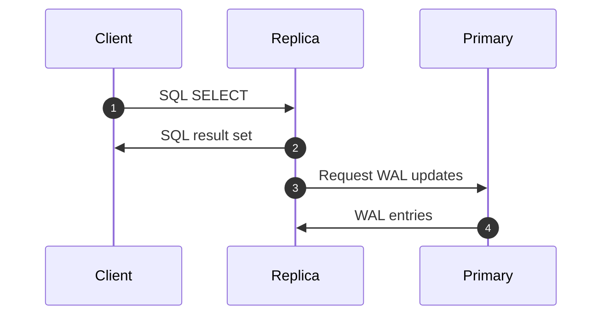
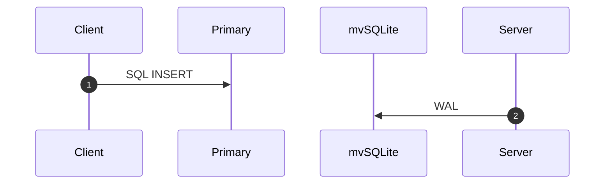
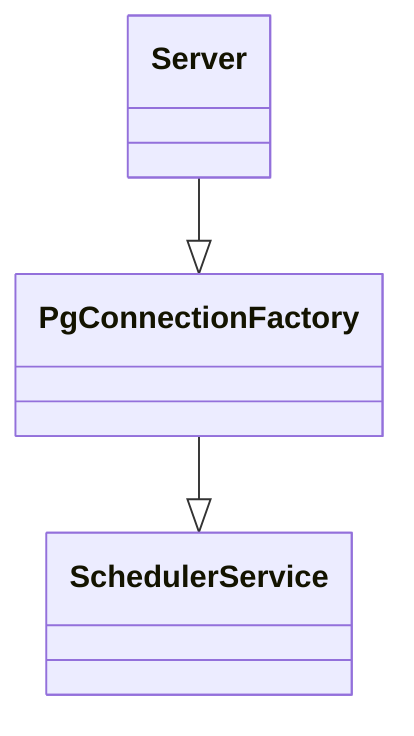

# Introduction

## Overview

`sqld` is a server mode for [libSQL](https://libsql.org), which provides SQLite interface and dialect for use cases such as edge functions where it's impractical to embed a full database engine.

## Sqld consistency model

### Building on top of sqlite

sqlite offers a strictly serializable consistency model. Since sqld is built on top of it, it inherits some of its properties.

### Transactional consistency

Any transaction in sqld is equivalent to sqlite transaction. When a transaction is opened, on the primary or replicas alike, the view that the transaction get is "frozen" is time. any write performed by a transaction is at the same time immediately visible to itself, as well as completely isolated from any other ongoing transactions. Therefore, sqld offers serializable transactions

### Real-time guarantees

All operations occurring on the primary are linearizable. However, there is no guarantee that changes made to the primary are immediately visible to all replicas. Sqld guarantees that a process (connection) will always see its write. Given that the primary is linearizable, it means that a process is guaranteed to see all writes that happened on the primary up until (at least) the last write performed by the process. This is not true for two distinct processes on the same replica, however, that can potentially read two different points in time. For example, a read for process A on the replica might return immediately returning some state, while a read on process B issued at the same time would need to wait to sync with the primary.

Note that reads on a replica are monotonical: once a value has been witnessed, only a value at least as recent can be witnessed on any subsequent read.

There are no global ordering guarantees provided by sqld: any two instances needn't be in sync at any time.

## Logical Architecture

The `sqld` consists of a:

* Client
* Primary server
* Replica servers (optional)
* mvSQLite backend (optional)

The client provides a SQLite ABI compatible inteface as a drop-in replacement for applications using libSQL or SQLite. The client library transforms SQLite C API calls into PostgreSQL wire protocol messages and sends them to the primary server.

The primary server is a `sqld` process, which servers SQLite dialect over the PostgreSQL wire protocol. The server can either be backed by single-node `libSQL` database or by a mvSQLite backend, which provides improved write concurrency, high availability, and fault tolerance using FoundationDB.

Replica servers is a `sqld` process, which only serves reads locally, and delegates writes to the primary server. The server is backed by a `libSQL` database.

Finally, the mvSQLite backend is a FoundationDB cluster, which can be optionally used by the primary server.

### Reads

Clients initiate reads by using the `sqlite3_exec()` API, for example, to perform a `SELECT` query.
The client sends messages over the network to a replica server, which performs the `SELECT` query on its local database, and sends back the results over the network.
The replica also periodically polls the primary server for WAL updates to refresh the database.

### Writes

Clients initialte writes with, for example, the `sqlite3_exec()` API by performing a `INSERT`, `UPDATE`, or `DELETE` SQL statement.
The primary server is responsible for writes.
The client sends writes to the primary server or a replica. If a replica receives a write, it delegates the write to the primary server.
The primary server either performs the write against its local `libSQL` database or processes it via `mvSQLite`, which uses FoundationDB.

## Server

The server architecture uses the service design pattern and uses `tower` as an interface. Tower provides middleware that we can reuse, and the design implements a clear separation of concern. Service is isolated and composable, which is a desirable property.

Here is a simplified architecture diagram:

`Server::serve` takes a `Service` (in fact, a Service factory), and calls the passed service with all incoming socket connections. The server runs the connections.

The `PgConnectionFactory` service takes a service factory that responds to `Query` requests and drives the Postgres wire protocol.

The `SchedulerServiceFactory` creates `SchedulerService`s that respond to `Query` requests, and schedule them to be performed.
